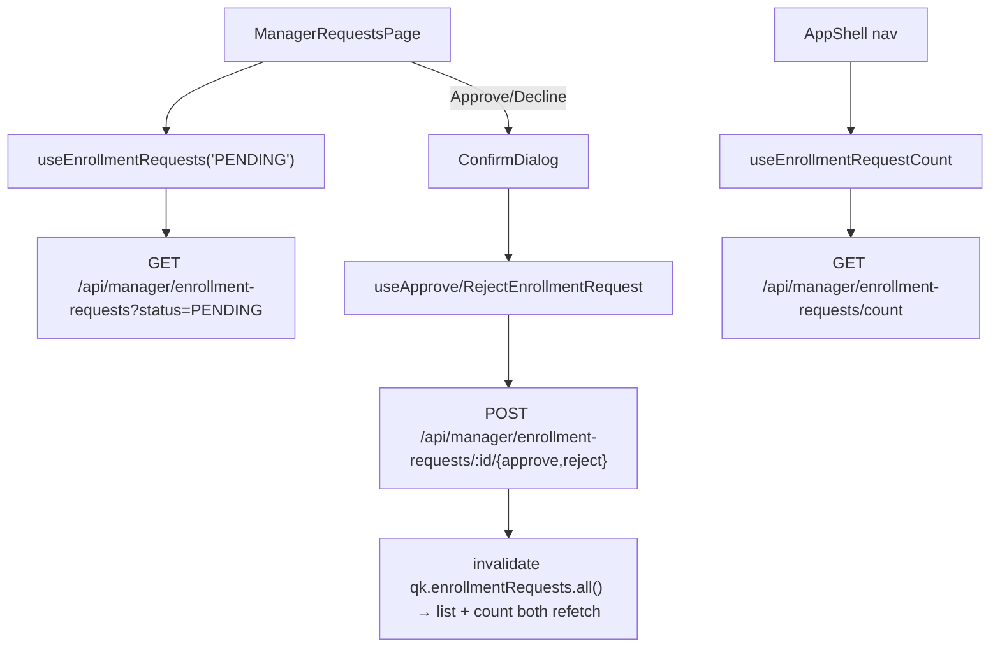

# ENROLLMENT REQUESTS — Web Admin

The manager's approval queue: passengers who redeemed a **private** driver's enrollment key wait
here for a decision before they're enrolled. **Manager-scoped only** — a manager sees only requests
against their own drivers; super-admins have no drivers of their own and this page/count is
disabled for them.

**Status:** `SHIPPED`

---

## 1. Purpose

Redeeming a public driver's enrollment key enrols a passenger immediately. Redeeming a **private**
driver's key raises a request instead (`status: 'PENDING'`) — this page is where the manager
approves or declines it. A pending count badges the "Enrollments" nav link app-wide (`AppShell`), not
just on this page, so a manager notices without opening it.

Since [multi-rider profiles](../../../backend/docs/modules/PROFILES.md) shipped, a request's
passenger can be a **managed profile** (a child, an employee) with no email/phone of its own — see
§4/§6 for how this page surfaces the owning account instead.

The page is also the **enrolled roster**, not only the queue. Approving a request used to make the
rider disappear from the portal entirely, and a rider who redeemed a *public* driver's key was never
visible in the first place, because they are written straight to `ACTIVE` and never queued. The
manager therefore had no way to answer "who rides with this driver". The **Enrolled** tab is that
answer, `?driver=` narrows it to one driver, and **Remove** is the manager-side counterpart to a
rider leaving. The Drivers page reaches it through a Riders count per driver
(`ManagerAccountsPage`), which comes from `riders: { active, pending }` on
`GET /api/manager/drivers`.

## 2. Key files (one job each)

| File | Responsibility |
|---|---|
| `src/pages/ManagerRequestsPage.jsx` | The page, tabbed **Pending / Enrolled / Declined**. `DataTable` of the rows for the selected status; Passenger/Account/Organization details/Driver/Driver ID columns, then Requested (Pending) or Enrolled/Declined from `decidedAt` (the rest). The Organization details column renders the backend's labelled `organizationDetails`, falling back to the raw `organizationValues` map. Pending rows offer Approve/Decline, Enrolled rows offer Remove; all three open the same shared `ConfirmDialog`. `passengerLabel()` disambiguates a managed profile in the dialog title. Tab and driver filter both live in the URL (`?status=`, `?driver=`). |
| `src/hooks/use-enrollment-requests.js` | `useEnrollmentRequests(status, driverId)`, `useEnrollmentRequestCount()` (nav badge, disabled for super-admins), `useApproveEnrollmentRequest`/`useRejectEnrollmentRequest`/`useRemoveEnrollment` — a decision invalidates both the list and the count together, and a removal also invalidates `qk.drivers` so the Riders count on the Drivers page follows it down. An unfiltered `PENDING` load also writes its length straight into the count cache, and the count query itself polls every `ENROLLMENT_COUNT_POLL_MS` (30s) and refetches on window focus, so the nav badge stays live without a reload. |
| `src/api.js` | `getEnrollmentRequests(status, driverId)`, `getEnrollmentRequestCount`, `approveEnrollmentRequest`, `rejectEnrollmentRequest`, `removeEnrollment` — all through the one `adminApi` HTTP layer. |
| `src/lib/queryKeys.js` | `qk.enrollmentRequests.{list(status, driverId), count(), all()}` — keyed by driver too, so one driver's roster and the full list cache separately. |
| `src/layout/AppShell.jsx` | Reads `useEnrollmentRequestCount()` to badge the "Enrollments" nav link on every manager screen. The badge still counts PENDING only. |

## 3. Data flow

## 4. Contracts (API / socket / storage)

Verified against the backend 2026-08-12.

| Kind | Endpoint | Client fn | Shape / notes |
|---|---|---|---|
| REST | `GET /api/manager/enrollment-requests?status=PENDING` | `getEnrollmentRequests` | `{data: Request[]}`. `Request.organization = {_id, name, serviceType}` (null only when nothing resolves one). `Request.passenger = {_id, name, riderCode, avatarUrl, contactPhone, email?, isManagedProfile, relation?, organizationValues: {…}, organizationDetails: [{key, label, value}], account?: {name, email, phoneNumber}}` — see backend `managerEnrollmentsController.js#resolvePassengers`. `_id` is the **rider profile's** id, not an account's. |
| REST | `GET /api/manager/enrollment-requests/count` | `getEnrollmentRequestCount` | `{data: {count}}` — pending count for the nav badge, disabled (`enabled: false`) for super-admins to avoid a guaranteed 403. |
| REST | `POST /api/manager/enrollment-requests/:id/approve` | `approveEnrollmentRequest` | Enrols the passenger with the driver; moves the request out of the pending list. |
| REST | `POST /api/manager/enrollment-requests/:id/reject` | `rejectEnrollmentRequest` | Leaves the passenger unenrolled; they may redeem the key again later. |

> Backend contract: [`backend/docs/modules/ADMIN.md`](../../../backend/docs/modules/ADMIN.md) §managerEnrollmentsController,
> and [`backend/docs/modules/PROFILES.md`](../../../backend/docs/modules/PROFILES.md) §6 for the
> `passenger.account` shape on a managed profile.

## 5. Not visible in the frontend

- **Approval is server-side.** This page renders what the backend says is pending for *this
  manager's* drivers — there is no client-side scoping to bypass or misconfigure.
- **The table shows a phone, not an email.** The Contact column reads `passenger.contactPhone`
  and falls back to the owning account's `phoneNumber`; the email was dropped because a manager
  chasing a request calls rather than writes. `passengerLabel()` still names the account's email in
  the confirm dialog, which is where disambiguating two same-named riders actually matters.
- **The row is top-aligned, not centred.** Two of the columns render a second line (rider code,
  form answers) and the rest are one line; with `DataTable`'s default `align-middle` each cell
  centred on its own height, so the first lines staggered. Those columns pass
  `meta: { cellClassName: 'align-top' }`; the actions column keeps the default so the buttons stay
  centred against the whole row.
- **The Organization column names the organization, then its answers.** The answers are stored
  keyed by field key, so rendering `organizationValues` alone read as `grade: 4` with no sign of
  whose form it was. The backend now sends `organization.name` plus `organizationDetails`
  (labelled and ordered by that organization's enrolment form); the raw map is still read as a
  fallback for a payload from an older backend.
- **A managed profile has no email/phone of its own.** `passenger.email` is only ever present for a
  primary (self-registered) rider; a managed profile's `passenger.account.{email,phoneNumber}` is
  the owning account holder's, resolved backend-side via the profile's shared `identityId`. The
  Account column and the confirm-dialog title both fall back to it — see `passengerLabel()` and the
  `account` column's `cell()` in `ManagerRequestsPage.jsx`.
- **The nav badge count is fetched on every manager screen**, not just this page — a manager sees
  it's non-zero before ever opening Requests.
- **The badge count is polled, and the queue writes to it.** `AppShell` never unmounts, so a count
  fetched once at sign-in would sit at its start value for the whole session and a request arriving
  later would only appear after a reload. `useEnrollmentRequestCount` therefore refetches every
  `ENROLLMENT_COUNT_POLL_MS` (30s) and on window focus, and `useEnrollmentRequests('PENDING')`
  writes the length of the queue it just loaded into the count cache so this page and the badge
  cannot disagree while both are on screen.
- **`riderCode` and `organizationValues` were rendered here before the backend sent them.** The
  page's Passenger and Organization details columns read both, and the backend resolved the
  passenger from the enrolment's deprecated `userId` — which the rider-profile enrolment path
  writes as null, so every request the current passenger app makes arrived as `passenger: null`
  and both columns sat empty. Fixed backend-side on 2026-08-19 by resolving from `studentId`; this
  page needed no change.

## 6. Known gotchas / regressions

- Don't read `passenger.email` alone to decide whether a passenger "has no contact info" — check
  `passenger.account?.email`/`phoneNumber` too, or a managed profile shows a false "None".
- `passengerLabel()` only appends the account email when `isManagedProfile && account.email` are
  both present — a managed profile whose account genuinely has no email yet (a pre-migration edge
  case) still reads by name alone, no broken parenthetical.
- One `ConfirmDialog` serves both Approve and Decline — `pendingDecision.approved` picks the
  copy/label/`destructive` styling. Don't split it into two dialogs; the shared state (`target`,
  `isDeciding`) would have to be duplicated.

## 7. Tests covering this module

| Layer | File | What it locks |
|---|---|---|
| Unit | `src/pages/__tests__/ManagerRequestsPage.test.jsx` | table renders requests, Approve/Decline → `ConfirmDialog` → mutation call, managed-profile tag + Account column fallback (email/phone), `passengerLabel()` in the dialog title, empty/loading/error states |
| Unit | `src/layout/__tests__/AppShell.test.jsx` | nav badge reads the pending count |

See [`../guides/ADDING_A_TEST.md`](../guides/ADDING_A_TEST.md) and the traceability row in
[`../TESTING_GUIDE.md`](../TESTING_GUIDE.md).

## 7a. Offline behaviour (Offline & Caching Audit §7)

`useEnrollmentRequests` persists to disk. Offline:

- The `DataTable` shows cached rows under an amber strip (or a calm `OfflineCard` if nothing is
  cached) instead of a red `ErrorState`.
- Staleness is **loud** here — the PENDING tab carries a `loud` `StaleChip` ("Queue as of …") and,
  when offline with rows, a prominent banner: "this queue may have changed since it was last
  loaded." A stale queue means a manager could approve a request another manager already handled.
- Approve / Decline / Remove are disabled offline (`!isOnline` on the buttons and
  `confirmDisabled` on the ConfirmDialog) and are **never queued** — a decision on a withdrawn or
  already-handled request must fail loudly, not silently replay.

## 8. Change protocol

Any change to this module must:
1. Run this module's tests green as a baseline (`ManagerRequestsPage.test.jsx`, `AppShell.test.jsx`).
2. Implement **page → hook → `api.js`** (never call `fetch`/`axios` directly).
3. Add/adjust tests for every changed behaviour.
4. Re-run green (`npm test`; `npm run lint`).
5. Update **this doc** + the [`TESTING_GUIDE.md`](../TESTING_GUIDE.md) row, and append a
   [`CHANGES.md`](../CHANGES.md) entry before pushing. A passenger-shape change here is also a
   backend contract change — update `backend/docs/modules/ADMIN.md`/`PROFILES.md` in the same PR.
