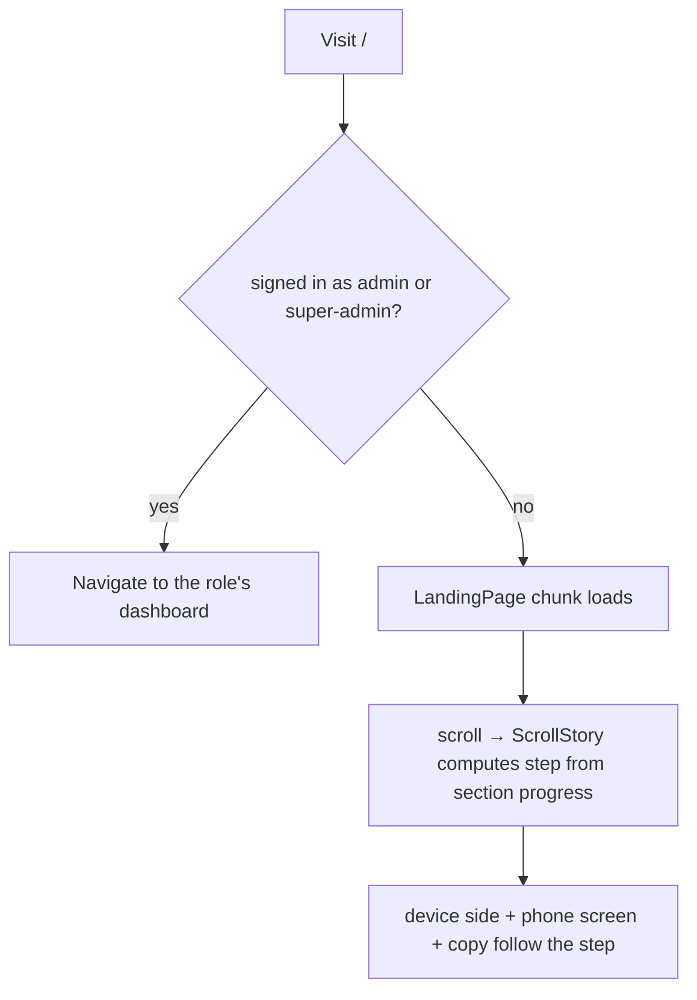

# LANDING — Web Admin

The public marketing page at `/`: what TrackMe is, how it works for riders and fleet managers, and
where a rider or a driver goes next.

**Status:** `IN-PROGRESS` — built and tested, but three things need an owner before launch: the
hero video (§6), the live download links (needs the app-releases backend deployed, `VITE_API_URL` set
in Vercel, and Git LFS enabled there — see [`APP_RELEASES.md`](APP_RELEASES.md)), and an agreed backend
endpoint for the driver email form (§4).

**Role:** none. It is public and signed-out only. A visitor already signed in as a manager or
super-admin is redirected to their dashboard before the page renders (`LandingGate` in `App.jsx`).

---

## 1. Purpose

Give a first-time visitor a reason to care in one screen, then route them: riders to the app,
drivers to an email form, fleet managers to `/login`. It makes **no backend calls** today.

The hard constraint is honesty: no invented statistics, ratings, user counts or testimonials. Every
claim describes a feature that exists (live tracking, enrollment keys with manager approval, fleet
management, custom routes). The phone screens are illustrative and say nothing about real data.

**The look** is deliberately editorial, not a template: big confident type, very little copy, warm
paper (`bone`) against `ink` and a flat `petrol` panel, a single bright teal reserved for live things,
and motion that means something (a countdown, a sentence that lights up as you read, a shuttle that
rides the page). It was rebuilt after the first version was called out as looking AI-made. The tells
to avoid: glow blobs, frosted-glass cards, gradient text, icon-in-a-box grids, and paragraphs of copy.

## 2. Key files (one job each)

| File | Responsibility |
|---|---|
| `src/App.jsx` | `LandingGate` + the public `/` route. Lazy-loads the page so the portal bundle never pays for it; redirects signed-in managers/super-admins. |
| `src/pages/landing/LandingPage.jsx` | Composes the sections, sets the document title, wraps everything in `dark` so the Atlas dark tokens apply whatever theme the portal last used. |
| `src/pages/landing/config.js` | **All copy and external links**: `HERO_VIDEO`, `APP_LINKS`, `PRIVACY_URL`, nav, the one `STATEMENT` sentence, the three `POINTS`, the four `STORY` steps, the portal screenshots. Edit here, not in components. |
| `src/pages/landing/Hero.jsx` | Full-viewport hero: the headline question, the live countdown, two buttons, an outlined ticker. Draws `NightRoad` behind it, or a `<video>` instead when `HERO_VIDEO` is set. |
| `src/pages/landing/NightRoad.jsx` / `roadScene.js` | **The hero's moving picture, drawn live in code**: a night road in perspective with a skyline, streaming lane lines, passing lamps, oncoming headlights and a shuttle with a tracking reticle ("SHUTTLE A · LIVE"). `roadScene.js` is the pure maths (projection, depth looping, the shuttle's box, the skyline); `NightRoad.jsx` turns it into canvas pixels. Original artwork, no assets, a few KB. Pauses off screen and in a hidden tab; one still frame under reduced motion. |
| `src/pages/landing/LiveEta.jsx` / `eta.js` | The "Right here. 3:57 to your stop" pill: a countdown that ticks, holds on "Now", and loops. Illustrative, not data. Static "4 min" under reduced motion. |
| `src/pages/landing/WhatSection.jsx` / `ScrubText.jsx` / `scrub.js` | The paper-coloured break after the hero: one big sentence that lights up word by word as it scrolls through the reading zone, then three short points. It overlaps the hero's bottom edge with rounded corners. The words are always real text in the DOM; only opacity moves. |
| `src/pages/landing/ScrollStory.jsx` | The main section. Desktop: a sticky 100vh stage inside a `STORY.length × 100vh` section; the device column slides left/right per step. Below `lg`: a stacked, non-sticky list. |
| `src/pages/landing/story.js` | Pure scroll maths: `sectionProgress`, `stepFromProgress`, `sideForStep`. |
| `src/pages/landing/RouteRail.jsx` / `journey.js` | **The page as a route.** A fixed rail on the left edge fills as you scroll; a small shuttle rides its tip; each section (`STOPS` in `journey.js`) is a stop that lights up on arrival. Decorative only (`aria-hidden`, `pointer-events-none`). `journey.js` holds the pure maths. The nav underlines the current section (`LandingNav.jsx`) instead of the rail naming it. |
| `src/pages/landing/DeviceFrames.jsx` | `PhoneFrame`, `LaptopFrame` bezels. |
| `src/pages/landing/screens/*` | `MapScreen`, `EnrollScreen`, `ProfilesScreen` (code-built phone UIs) and `PortalScreen` (rotating real captures of the manager portal). |
| `src/pages/landing/JoinSection.jsx` / `LeadForm.jsx` / `validation.js` | "Rider or driver?": two full-width panels (petrol for riders with the store buttons, ink for drivers with the email form). On a wide screen the panel under the pointer widens a little. |
| `src/pages/landing/landing.css` | Everything custom: the palette variables, reveal, grain, keyframes, outlined type, the rider/driver split. Scoped under `.landing`. |
| `tailwind.config.cjs` | Registers `l-ink`, `l-bone`, `l-petrol`, `l-teal` as real Tailwind colours (see §6 for why this matters). |
| `src/hooks/use-media-query.js` | `useMediaQuery(query)`, used to pick the sticky vs stacked story. |
| `public/landing/portal-*.jpg` | Real captures of the manager portal in dark mode, taken from the E2E mock data (not real fleets). Re-take them if the portal's look changes. |

## 3. Data flow

None: static content. The only state is local UI state (scroll step, form text).

## 4. Contracts (API / socket / storage)

| Kind | Name | Notes |
|---|---|---|
| REST | **driver email: endpoint not agreed yet** | `LeadForm` takes `onSubmit(email)`. `LandingPage` defaults it to `submitDriverInterest` (`driverInterest.js`) **only when `DRIVER_INTEREST_ENDPOINT` in `config.js` is set**; today it is `null`, so the form validates and then says plainly that nothing was sent. The request it will make is `POST <endpoint>` with `{ email, source: 'landing' }` and any 2xx = success. **That shape is a proposal, not an agreed contract**: confirm it with the backend owner, then set the endpoint, and add the backend doc + sandbox fixture per `CLAUDE.md`. Like `useAppDownloadLinks`, it calls the API directly because the form is public and signed-out. |
| REST | `GET /api/app-releases/latest` | The rider/driver store buttons in `JoinSection.jsx` now fetch live download links via `useAppDownloadLinks.js` — see [`APP_RELEASES.md`](APP_RELEASES.md) for the full contract; this file does not duplicate it. |
| External | `APP_LINKS.ios` / `.android` | `null` today — the static fallback `useAppDownloadLinks()` uses until a real release exists, at which point the buttons render disabled with "Coming soon". The Android button is labelled **"Android (APK)"** because it is a direct file download, not a Google Play listing; the iOS button is **"iPhone (iOS)"** and stays "Coming soon" until an iOS build is registered. |
| External | `PRIVACY_URL` | The published `trackme-privacy` GitHub Pages site. |

## 5. Not visible in the frontend

- The page is **always dark in its frame** by design (the root carries `dark`) and ignores the
  portal's theme toggle. The paper-coloured section is a deliberate light break inside it.
- The portal sets `overflow-x: hidden` on `html`, `body` and `#root`. That makes `#root` a scroll
  container, which silently breaks `position: sticky`. `landing.css` overrides it for pages that
  contain `.landing`. If the story stage ever scrolls away instead of pinning, look here first.
- When `HERO_VIDEO` is set the hero shows the clip with a teal `mix-blend-color` grade over it, and
  `NightRoad` is not drawn.

## 6. Known gotchas / open items

- **Hero footage is optional.** `HERO_VIDEO` is `null`, so the coded night road shows. To use real
  footage instead: put `hero.mp4` (+ optional `hero.webm`, `hero-poster.jpg`) in `public/landing/` and
  set it in `config.js`. Keep it under ~4 MB, muted, loopable, 10-20 s, and check the licence is
  **commercial** (Mixkit's "Restricted" clips are personal-use only). A good pairing is the clip as the
  base with `NightRoad`'s reticle drawn over it; that needs a small change in `Hero.jsx`.
- **Opacity on a CSS-variable colour silently does nothing in Tailwind.** `text-[color:var(--x)]/60`
  generates no rule, so the colour renders at full strength and nothing warns you. The landing palette
  is therefore registered as real Tailwind colours from RGB channels (`--l-ink-rgb` etc. in
  `landing.css`, `l-ink` etc. in `tailwind.config.cjs`). Write `text-l-bone/60`, never
  `text-[color:var(--l-bone)]/60`. This bug made the nav transparent and every "dimmed" text full-bright
  before it was caught.
- **Never name a logic file and a component the same apart from case** (`nightRoad.js` next to
  `NightRoad.jsx`). On Windows/macOS the file system is case-insensitive, so `import './NightRoad'`
  resolved to the `.js` file and the page crashed, while Linux CI would have passed. The scene's maths
  is `roadScene.js` for this reason.
- `ScrollStory` assumes a **4-step** story (three phone screens + one laptop). Adding a step means
  a screen in `PHONE_SCREENS` (or a laptop step) and checking `STORY.length x 100vh` is still a sane
  scroll length.
- The phone screens and the hero scene use sample content ("Morning Shuttle A", a six-character key, a
  4:00 countdown). They are illustrations, not data.
- **Phones are designed, not just shrunk.** Below `lg` (1024px) the sticky stage cannot slide a device
  sideways, so `StackedStory` takes over: phones tilt in alternating directions (echoing the swap), and
  the laptop is shown whole with a row of area pills beneath it. `NightRoad` re-frames for portrait
  (higher horizon, road centred, shuttle above the headline). Story rows use `minmax(0,1fr)` grid
  tracks so no wide child can drag a row past the screen edge.
- **`flex-1` in a column flex container collapses height.** The email input once rendered ~20px tall on
  phones for exactly this reason; it is `w-full shrink-0` on phones and `sm:flex-1` from `sm` up.
- **The route rail follows `STOPS` in `journey.js`.** Adding or renaming a section means adding its `id`
  there. It reads each section's real position on every scroll frame, so layout shifts (fonts, images)
  are picked up. It ends 160px above the viewport bottom so the shuttle arrives at the last section, not
  on top of the footer.
- **Scrolling in tests:** `html` has `scroll-behavior: smooth` on this page, so a bare
  `window.scrollTo` is animated and a screenshot taken right after catches the page mid-scroll. Use
  `scrollTo({ top, behavior: 'instant' })` when capturing or asserting positions.
- The driver form has an invisible honeypot field (`name="website"`). A bot that fills it gets a fake
  success and nothing is sent.
- **Reduced motion:** CSS animations and transitions are neutralised globally; `NightRoad` paints one
  still frame; `LiveEta` shows a static "4 min"; `ScrubText` shows every word fully lit; the route
  shuttles on the SVG story are skipped via `useMediaQuery('(prefers-reduced-motion: reduce)')`.
- **jsdom has no canvas.** `src/test/setup.js` stubs `getContext` to return `null`, which is what a
  real browser returns when drawing is unavailable, and `NightRoad` must keep coping with it.

## 7. Tests covering this module

| Layer | File | What it locks |
|---|---|---|
| Unit | `src/pages/landing/__tests__/story.test.js` | step boundaries, clamping, no divide-by-zero, left/right alternation |
| Unit | `src/pages/landing/__tests__/LeadForm.test.jsx` | email validation, error clearing, success, failure, the honest "not connected" state, and the honeypot (drops the submission; out of tab order and hidden from screen readers) |
| Unit | `src/pages/landing/__tests__/journey.test.js` | route maths: progress clamping (overscroll), stop placement, active stop (incl. nothing-to-scroll and landing a hair short), stop list order |
| Component | `src/pages/landing/__tests__/RouteRail.test.jsx` | decorative-only (`aria-hidden`, no pointer events), starts at the first stop and hidden until scrolled, one unreached dot per later section |
| Unit | `src/pages/landing/__tests__/driverInterest.test.js` | refuses to run with no endpoint; POSTs `{ email, source: 'landing' }` as JSON; throws on non-2xx and on network failure |
| Component | `src/pages/landing/__tests__/JoinSection.test.jsx` | "Coming soon" buttons while no release exists; live links once the API returns releases; the direct driver download line |
| Unit | `src/pages/landing/__tests__/roadScene.test.js` | the scene maths: projection towards the horizon, depth looping with no seam, streaming speed, the shuttle fully on screen (with room for its tag) on five screen sizes and above the headline on a phone, deterministic skyline, haze |
| Component | `src/pages/landing/__tests__/NightRoad.test.jsx` | decorative canvas; copes with no 2D context; one still frame and no animation under reduced motion; animates by default and cancels its frame and listeners on unmount; pixel ratio is capped |
| Unit | `src/pages/landing/__tests__/scrub.test.js` | the reading zone and per-word opacity: dim before, lit after, in reading order, no NaN |
| Component | `src/pages/landing/__tests__/ScrubText.test.jsx` | the whole sentence stays real text; dim below the fold, lit once read, lit in order part-way, fully lit under reduced motion |
| Unit | `src/pages/landing/__tests__/eta.test.js` | countdown formatting, holds on "Now", loops back to 4:00 |
| Component | `src/pages/landing/__tests__/LiveEta.test.jsx` | starts at 4:00, ticks each second, says the shuttle is at the stop then restarts, static "4 min" under reduced motion, clears its timer
| Component | `src/pages/landing/__tests__/LandingPage.test.jsx` | the hero question and both CTAs, the statement and the three points, all four story steps, store buttons disabled, section order, no invented numbers, title set/restored |
| Component | `src/__tests__/App.test.jsx` | signed-out `/` shows the landing page; unserved role stays on it; signed-in redirects (existing cases) |
| E2E | `e2e/landing.spec.ts` | the page loads with no console errors; the hero night road is really painted and moves, is decorative and never steals a click, and holds one still frame under reduced motion; the countdown ticks; the statement lights up word by word on scroll; the nav underlines the current section; the sticky stage pins and the phone goes left, right, left, right; no horizontal overflow at 1440, 375 and 360; the email field and button are full width and >=44px tall on a phone; honest rider button labels; the route shuttle follows a real scroll and lights each stop, is invisible at the top, never blocks taps and stays in the left gutter on a phone; nav anchors; manager and super-admin redirects |

## 8. Change protocol

1. Baseline: `npm test` and `npx playwright test e2e/landing.spec.ts` green.
2. Copy and links change in `config.js` only.
3. Keep every claim real. If a feature is not shipped, it does not go on the page.
4. Re-run green, update this doc and the `TESTING_GUIDE.md` rows, add a `CHANGES.md` entry.
