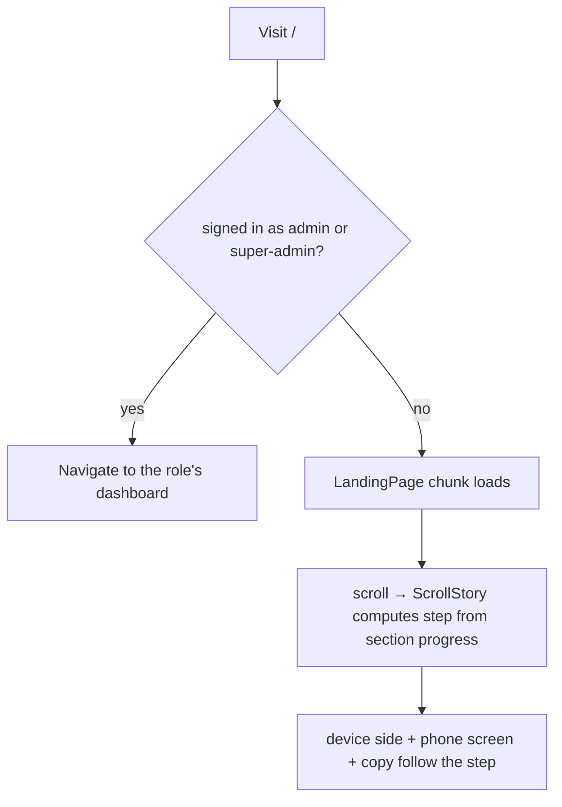

# LANDING — Web Admin

The public marketing page at `/`: what TrackMe is, how it works for riders and fleet managers, and
where a rider or a driver goes next.

**Status:** `IN-PROGRESS` — built and tested, but three things need an owner before launch: the
hero video (§6), the real store URLs, and a backend endpoint for the driver email form (§4).

**Role:** none. It is public and signed-out only. A visitor already signed in as a manager or
super-admin is redirected to their dashboard before the page renders (`LandingGate` in `App.jsx`).

---

## 1. Purpose

Give a first-time visitor a reason to care in one screen, then route them: riders to the app,
drivers to an email form, fleet managers to `/login`. It makes **no backend calls** today.

The hard constraint is honesty: no invented statistics, ratings, user counts or testimonials. Every
claim describes a feature that exists (live tracking, enrollment keys with manager approval, fleet
management, custom routes). The phone screens are illustrative and say nothing about real data.

## 2. Key files (one job each)

| File | Responsibility |
|---|---|
| `src/App.jsx` | `LandingGate` + the public `/` route. Lazy-loads the page so the portal bundle never pays for it; redirects signed-in managers/super-admins. |
| `src/pages/landing/LandingPage.jsx` | Composes the sections, sets the document title, wraps everything in `dark` so the Atlas dark tokens apply whatever theme the portal last used. |
| `src/pages/landing/config.js` | **All copy and external links**: `HERO_VIDEO`, `APP_LINKS`, `PRIVACY_URL`, nav, the four bento pillars, the four story steps, the portal screenshots. Edit here, not in components. |
| `src/pages/landing/Hero.jsx` | Full-viewport hero: headline reveal, cursor spotlight, glass card, marquee. Renders `<video>` only when `HERO_VIDEO` is set. |
| `src/pages/landing/RouteCanvas.jsx` | The hero's fallback backdrop: animated routes and moving vehicles in SVG. No assets. |
| `src/pages/landing/WhatSection.jsx` / `MiniRoute.jsx` | "What is TrackMe" statement and the bento grid. |
| `src/pages/landing/ScrollStory.jsx` | The main section. Desktop: a sticky 100vh stage inside a `STORY.length × 100vh` section; the device column slides left/right per step. Below `lg`: a stacked, non-sticky list. |
| `src/pages/landing/story.js` | Pure scroll maths: `sectionProgress`, `stepFromProgress`, `sideForStep`. |
| `src/pages/landing/DeviceFrames.jsx` | `PhoneFrame`, `LaptopFrame` bezels. |
| `src/pages/landing/screens/*` | `MapScreen`, `EnrollScreen`, `ProfilesScreen` (code-built phone UIs) and `PortalScreen` (rotating real captures of the manager portal). |
| `src/pages/landing/JoinSection.jsx` / `LeadForm.jsx` / `validation.js` | Rider/driver section, the store buttons, and the driver email form. |
| `src/pages/landing/landing.css` | Everything custom: reveal, grain, keyframes, glass. Scoped under `.landing`. |
| `src/hooks/use-media-query.js` | `useMediaQuery(query)`, used to pick the sticky vs stacked story. |
| `public/landing/portal-*.jpg` | Real captures of the manager portal in dark mode, taken from the E2E mock data (not real fleets). Re-take them if the portal's look changes. |

## 3. Data flow

None: static content. The only state is local UI state (scroll step, form text).

## 4. Contracts (API / socket / storage)

| Kind | Name | Notes |
|---|---|---|
| REST | **none yet** | `LeadForm` takes an `onSubmit(email)` prop. `LandingPage` accepts `onDriverSubmit` and passes it down; nothing is wired. **No backend endpoint exists for driver email capture**, so the form validates, then says plainly that nothing was sent. When an endpoint exists, add the call to `src/api.js` (never `fetch` from the page), wire it where `LandingGate` renders `LandingPage`, and add the backend doc + sandbox fixture per `CLAUDE.md`. |
| External | `APP_LINKS.ios` / `.android` | `null` today, so the buttons render disabled with "Coming soon". |
| External | `PRIVACY_URL` | The published `trackme-privacy` GitHub Pages site. |

## 5. Not visible in the frontend

- The page is **always dark** by design; it ignores the portal's theme toggle.
- The portal sets `overflow-x: hidden` on `html`, `body` and `#root`. That makes `#root` a scroll
  container, which silently breaks `position: sticky`. `landing.css` overrides it for pages that
  contain `.landing`. If the story stage ever scrolls away instead of pinning, look here first.
- The hero's `mix-blend-color` teal grade is what pulls arbitrary stock footage into the palette.

## 6. Known gotchas / open items

- **Hero video: none yet.** `HERO_VIDEO` is `null`, so the animated route map shows instead. To add
  one: put `hero.mp4` (+ optional `hero.webm`, `hero-poster.jpg`) in `public/landing/` and set the
  config. Keep it under ~4 MB, muted, loopable, 10–20 s, and check its licence.
- `ScrollStory` assumes a **4-step** story (three phone screens + one laptop). Adding a step means
  a screen in `PHONE_SCREENS` (or a laptop step) and checking `STORY.length × 100vh` is still a sane
  scroll length.
- The phone screens use sample content ("Morning Shuttle A", a six-character key). They are
  illustrations, not data.
- Two animations on one element override each other (`animation` is a shorthand). The hero card
  nests `l-fade-in` around `l-float` for that reason.
- Reduced motion: CSS animations and transitions are neutralised globally; SVG `animateMotion`
  vehicles are skipped via `useMediaQuery('(prefers-reduced-motion: reduce)')`.

## 7. Tests covering this module

| Layer | File | What it locks |
|---|---|---|
| Unit | `src/pages/landing/__tests__/story.test.js` | step boundaries, clamping, no divide-by-zero, left/right alternation |
| Unit | `src/pages/landing/__tests__/LeadForm.test.jsx` | email validation, error clearing, success, failure, and the honest "not connected" state |
| Component | `src/pages/landing/__tests__/LandingPage.test.jsx` | section order, hero CTAs, all four story steps, store buttons disabled, no invented numbers, title set/restored |
| Component | `src/__tests__/App.test.jsx` | signed-out `/` shows the landing page; unserved role stays on it; signed-in redirects (existing cases) |
| E2E | `e2e/landing.spec.ts` | sticky stage pins and the phone goes left → right → left → right; no console errors; no horizontal overflow at 1440 and 375; nav anchors; manager/super-admin redirect |

## 8. Change protocol

1. Baseline: `npm test` and `npx playwright test e2e/landing.spec.ts` green.
2. Copy and links change in `config.js` only.
3. Keep every claim real. If a feature is not shipped, it does not go on the page.
4. Re-run green, update this doc and the `TESTING_GUIDE.md` rows, add a `CHANGES.md` entry.
