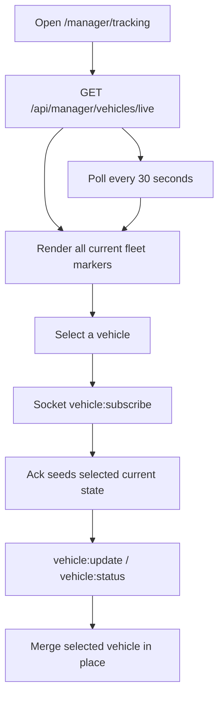

# TRACKING — Web Admin

The manager fleet map: see the current state of every owned vehicle, select one, and follow that
vehicle live over Socket.IO.

**Status:** `SHIPPED`

**Role:** manager only. The backend scopes the REST fleet and every socket subscription to the
authenticated manager's `Vehicle.managerId`.

> Rewritten 2026-08-14 against the rebuilt vehicle-scoped backend contract. The previous version
> documented deleted history endpoints and `bus:update` / `manager:join-bus` rooms that no longer
> existed.

---

## 1. Purpose

Give a manager operational visibility of their fleet without inventing location history the
backend does not store. REST bootstraps every vehicle's current position and polls every 30 seconds
as a resilience fallback. The selected vehicle additionally receives low-latency socket updates.

## 2. Key files

| File | Responsibility |
|---|---|
| `src/pages/ManagerTrackingPage.jsx` | Atlas map page, fleet selector/list, markers, telemetry, and loading/empty/error/offline states. |
| `src/hooks/use-tracking.js` | Fleet query, socket lifecycle, current-position merge, stale-state classification. |
| `src/pages/ManagerAccountsPage.jsx` | The drivers directory's Location column: the same live/stale/offline state per driver, and the link into this page. |
| `src/lib/tracking-socket.js` | The Socket.IO adapter and vehicle-scoped event names. |
| `src/api.js` | `adminApi.getManagerFleetLive()`. |
| `src/lib/queryKeys.js` | `qk.vehicles.managerLive()`. |
| `src/lib/googleMaps.js` | Resolves the Vite Google Maps browser key and compatibility alias. |
| `src/App.jsx` / `src/layout/AppShell.jsx` | Manager-only route and navigation entry. |

## 3. Data flow

Only one vehicle is socket-subscribed at a time. This stays comfortably below the backend's
five-subscriptions-per-second limiter and 25-room cap; every other vehicle remains visible through
the fleet snapshot and polling fallback.

## 4. Contracts

| Kind | Name | Notes |
|---|---|---|
| REST | `GET /api/manager/vehicles/live` | Returns every manager-owned vehicle as `{ vehicleId, live, location, vehicle, driver }`. |
| Socket auth | connection | `io(getApiBaseUrl(), { transports:['websocket'], auth:{token} })`; token comes from `readStoredAuth()`, including session-storage logins. |
| Socket C→S | `vehicle:subscribe { vehicleId }` | Manager authorization is checked against authoritative `Vehicle.managerId`; ack has the same current-state shape as REST. |
| Socket C→S | `vehicle:unsubscribe { vehicleId }` | Sent on selection change and page cleanup. |
| Socket S→C | `vehicle:update` | Replaces only the selected vehicle's current position; does not append a trail. |
| Socket S→C | `vehicle:status` | Updates live/offline status while preserving the last known position. |
| Env | `VITE_API_URL` / `VITE_SANDBOX_API_URL` | Resolved dynamically through `getApiBaseUrl()` so Developer Mode's sandbox toggle also moves the socket. |
| Env | `VITE_GOOGLE_MAPS_KEY` | Browser-restricted Google Maps JavaScript API key. `VITE_GOOGLE_MAPS_API_KEY` is also accepted. |

The full event and authorization contract is in
[`TrackMe-backend/docs/modules/REALTIME.md`](../../../TrackMe-backend/docs/modules/REALTIME.md).

## 5. States and behavior

- **Loading:** flat `CardSkeleton`; no fake marker data.
- **Empty fleet:** “No vehicles in your fleet”.
- **REST error:** `ErrorState` with retry.
- **Socket disconnected:** warning explains that 30-second REST polling continues; Socket.IO
  auto-reconnects.
- **Live, no position:** the driver pressed GO but the first GPS fix has not arrived; the page says
  so explicitly.
- **Stale:** `live:true` with `receivedAt` older than 90 seconds renders a stale warning and amber
  state until the backend sweeper marks it offline or a fresh fix arrives.
- **Offline:** last known marker may remain visible, but it is labelled offline; `Vehicle.isActive`
  is never used as a liveness signal.

GPS `speed` is the native location value in metres/second and is converted to km/h for display.

## 5a. Entry points

The page opens on the first vehicle with a position, unless `?vehicle=<vehicleId>` names one — which
is how the drivers directory hands over. A deep-linked vehicle survives the first render, where the
fleet snapshot has not arrived yet, and the URL is then kept in step (`replace`) with whatever
vehicle is actually being followed.

The drivers directory (`/manager/accounts`) carries a **Location** column driven by
`useManagerFleetLive()` — the same fleet query and the same `trackingState()` classification, with
no socket: one badge per row does not need lower-latency updates, and a socket per row would exceed
the backend's subscription limits. Live and stale rows link here by `vehicleId`; offline rows and
drivers with no vehicle say so and link nowhere, because there is no position to open. That column
is about the journey, and is deliberately separate from the neighbouring **Status** column, which
is about the account.

## 6. Security and scoping

- The manager page is absent from the super-admin route tree.
- REST returns only vehicles whose `managerId` matches the authenticated manager.
- The socket independently re-checks ownership on every subscription. Hiding another manager's
  vehicle in the UI is not the authorization boundary.
- A missing or rejected socket token never causes the page to show fabricated “offline” fleet
  data; the authenticated REST query remains the fallback and the stream error is visible.

## 7. Known constraints

- There is one current-location document per vehicle and **no history collection**, so there is no
  breadcrumb/polyline or 15/30/60-minute selector.
- Socket fan-out assumes one backend instance. Scaling the backend horizontally requires the
  Socket.IO Redis adapter first; REST polling stays cross-process correct.
- **Maps symbols come from three different libraries.** `useMapsLibrary('maps')` gives `Map`;
  `Marker` is in `'marker'`; `SymbolPath` and `LatLngBounds` are in `'core'`. Asking for the wrong
  library still resolves to a real object, so the mistake only surfaces where the missing name is
  used — for markers, the first vehicle with a position, which crashes the page. Test mocks for
  `useMapsLibrary` must therefore be keyed by library name.
- Google Maps needs network access and a browser-restricted Maps JavaScript API key, independent
  of the TrackMe API. If the key is missing, telemetry and fleet selection remain available while
  the map shows explicit configuration guidance.

## 8. Tests covering this module

| Layer | File | What it locks |
|---|---|---|
| API | `src/__tests__/api.test.js` | manager fleet live endpoint path. |
| Unit | `src/lib/__tests__/tracking-socket.test.js` | active API-mode URL, auth, event names and payloads. |
| Unit | `src/hooks/__tests__/use-tracking.test.jsx` | REST/socket freshness merge and live/stale/offline classification. |
| RTL | `src/pages/__tests__/ManagerTrackingPage.test.jsx` | Google map/markers, missing-key guidance, telemetry, selection, first-fix state, socket fallback, loading/error/empty states, and the `?vehicle=` deep link. |
| RTL | `src/pages/__tests__/ManagerAccountsPage.test.jsx` | the drivers directory Location column: live, stale, offline, missing from the snapshot, no vehicle, and the link it builds. |
| RTL | `src/__tests__/App.test.jsx`, `src/layout/__tests__/AppShell.test.jsx` | manager route and navigation entry. |

## 9. Change protocol

Socket names and payloads are a cross-repo contract. Any change here must update backend
`REALTIME.md` and the rider/driver consumer docs in the same change.
