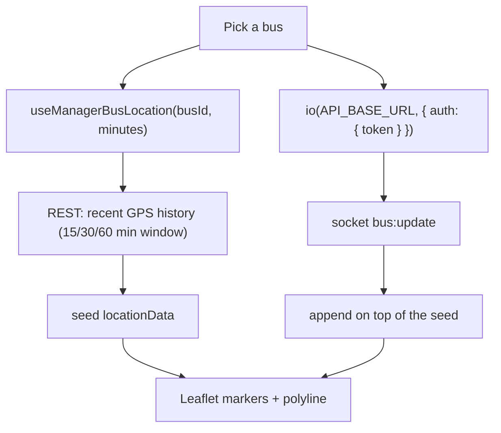

# TRACKING — Web Admin

The manager live-tracking map: pick a bus, see its recent GPS track seeded from REST, then follow
it live over Socket.IO.

**Status:** `SHIPPED`

**Role:** manager (and super-admin where fleet scope allows).

> Mined from the retired umbrella doc `docs/modules/web-admin/LIVE_TRACKING_FEATURE.md` and
> **re-verified against `src/`**. That doc predated this page entirely — it claimed "the web admin
> app does not stream driver GPS directly", which is no longer true. What survived from it is §6,
> the data-dependency invariants, which are still correct and still bite.

---

## 1. Purpose

Give a manager operational visibility of their fleet in motion. The map seeds from a REST history
window so the track isn't empty on load, then appends live positions from the socket. Drivers
produce the data (`driver-app`); this page only consumes it.

## 2. Key files

| File | Responsibility |
|---|---|
| `src/pages/ManagerTrackingPage.jsx` | The page: bus picker, Leaflet map (`react-leaflet`), markers + polyline, and its **own** `socket.io-client` connection. |
| `src/hooks/use-tracking.js` | `useManagerBusLocation(busId, minutes)` → recent GPS history. `staleTime: 0`, `enabled` on `busId`. Seeds the track and acts as the history-window fallback. |
| `src/hooks/use-buses.js` | `useManagerBuses` — the bus picker's source. |
| `src/lib/polyline.js` | Polyline decoding for route geometry. |
| `src/lib/map-tokens.js` | Map styling tokens. |

## 3. Data flow

## 4. Contracts

| Kind | Name | Notes |
|---|---|---|
| REST | `adminApi.getManagerBusLocation(busId, minutes)` | Look-back window is **15 / 30 / 60** minutes. `staleTime: 0` — always refetched. |
| Socket | connection | `io(API_BASE_URL, { transports: ['websocket'], auth: { token } })`. |
| Socket | `bus:update` | Live position; see [`backend REALTIME.md`](../../../backend/docs/modules/REALTIME.md). Backend fans out to `route:<routeId>` **and** `bus:<busId>`. |
| Socket | `manager:join-bus` / `manager:leave-bus` | The manager room for a single vehicle. |
| Env | `VITE_API_URL` | Falls back to `http://localhost:5000`. |

## 5. Not visible in the frontend

- **This page opens its own socket connection**, separate from the app's HTTP layer — it imports
  `io` directly rather than going through `src/api.js`. That's the one sanctioned exception to the
  "all traffic through `api.js`" rule, because `api.js` is REST-only. Clean it up on unmount.
- **REST seeds, socket appends.** Neither alone is sufficient: without the seed the map is blank
  until the next GPS fix; without the socket it's a static history.
- The driver emits roughly every **3 s / 3 m** (`driver-app`'s
  [`LOCATION_TRACKING.md`](../../../driver-app/docs/LOCATION_TRACKING.md)) — that, not this page,
  sets the real update rate. A "laggy map" is usually a driver-side or network issue.

## 6. Data-dependency invariants (operational — these still bite)

Tracking silently degrades when the underlying records disagree. Carried forward from the retired
doc because it is still accurate:

- **`bus.routeId` must match an existing `route.routeId`.** A mismatch means the bus never lands in
  the right route room, so its updates fan out nowhere useful.
- **`routeId` consistency must be maintained** across edits — renaming/reassigning without updating
  buses breaks tracking after the fact, not at edit time.
- **`serviceType`** affects filtering in `user-app` (which excludes `PUBLIC` in the ShuttleGo build).
- **`bookingEnabled`** affects booking availability, not tracking — don't conflate them.

### Operational verification checklist
1. Route exists and is active.
2. Bus has the correct `routeId` and an assigned driver.
3. `bookingEnabled` matches the intended business state.
4. The driver account has the `driver` role and is assigned to that bus.
5. Route/service data is still consistent after any edit.

## 7. Known gotchas

- A bus marked active with **no recent location** usually means the driver app lost foreground
  permission or connectivity — not a backend fault.
- There is **no stale-session alerting** and no force-stop control. The retired doc proposed both
  (active-bus count, last-location timestamp, stale list, force-stop by `busId`); neither exists.
  Still reasonable enhancements.
- `bus:status-update` is emitted by the backend; check whether this page reacts before assuming a
  stopped bus updates here.

## 8. Tests covering this module

| Layer | File | What it locks |
|---|---|---|
| Unit | `src/hooks/__tests__/` | `useManagerBusLocation` key, `enabled` gating, `staleTime` |
| Unit | `src/lib/__tests__/` | polyline decoding |
| E2E | Playwright | pick a bus → map renders a track |

## 9. Change protocol

See [`_MODULE_TEMPLATE.md`](../guides/_MODULE_TEMPLATE.md). Socket payload changes are a cross-repo
contract — update [`backend REALTIME.md`](../../../backend/docs/modules/REALTIME.md) too.
